# Test rig state forecaster

The repository contains the code and pipeline to automate the state analysis and failure forecasting of the test rig.

## Local training pipeline

The chart below represents the orchestrated stages of the local training pipeline. Artifacts are stored and tracked locally.

```mermaid
flowchart TD
	node1["build_features"]
	node2["evaluate@CHARGE_HYD_POWER"]
	node3["evaluate@CHARGE_MECH_POWER"]
	node4["evaluate@DRIVE_POWER"]
	node5["evaluate@GEARBOX_COOLER_POWER"]
	node6["evaluate@LOAD_POWER"]
	node7["evaluate@MAIN_COOLER_POWER"]
	node8["evaluate@SCAVENGE_POWER"]
	node9["evaluate@SERVO_HYD_POWER"]
	node10["evaluate@SERVO_MECH_POWER"]
	node11["evaluate@Vibration_1"]
	node12["evaluate@Vibration_2"]
	node13["read_raw_local"]
	node14["split_data"]
	node15["train@CHARGE_HYD_POWER"]
	node16["train@CHARGE_MECH_POWER"]
	node17["train@DRIVE_POWER"]
	node18["train@GEARBOX_COOLER_POWER"]
	node19["train@LOAD_POWER"]
	node20["train@MAIN_COOLER_POWER"]
	node21["train@SCAVENGE_POWER"]
	node22["train@SERVO_HYD_POWER"]
	node23["train@SERVO_MECH_POWER"]
	node24["train@Vibration_1"]
	node25["train@Vibration_2"]
	node1-->node14
	node13-->node1
	node14-->node2
	node14-->node3
	node14-->node4
	node14-->node5
	node14-->node6
	node14-->node7
	node14-->node8
	node14-->node9
	node14-->node10
	node14-->node11
	node14-->node12
	node14-->node15
	node14-->node16
	node14-->node17
	node14-->node18
	node14-->node19
	node14-->node20
	node14-->node21
	node14-->node22
	node14-->node23
	node14-->node24
	node14-->node25
	node15-->node2
	node16-->node3
	node17-->node4
	node18-->node5
	node19-->node6
	node20-->node7
	node21-->node8
	node22-->node9
	node23-->node10
	node24-->node11
	node25-->node12
```

